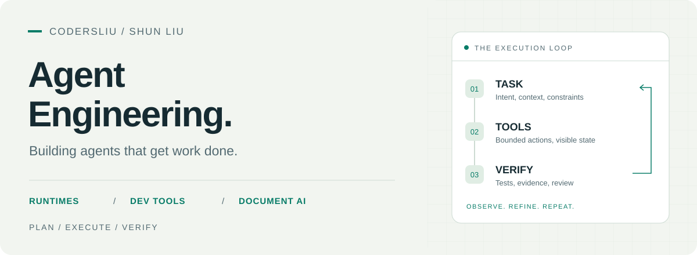

<picture>
  <source media="(prefers-color-scheme: dark)" srcset="./assets/hero-dark.svg">
  <source media="(prefers-color-scheme: light)" srcset="./assets/hero-light.svg">
  
</picture>

# Shun Liu

**Agent 工程 / AI 开发工具 / 文档智能**

构建让 AI 完成实际任务的工具：发现与调用工具、在明确边界内执行、保留过程证据，并让结果可审阅、可恢复。

[项目作品](#selected-work) · [参与贡献](#collaboration) · [工程关注点](#engineering) · [博客](https://codersliu.github.io) · [邮件联系](mailto:liushunforever@aliyun.com)

## 01 / Selected work

### Agent Harness

**本地优先的 Windows 桌面智能体执行框架**

把本机工具发现、技能学习和受控执行接成完整任务流程。

- 发现 CLI / MCP 能力，将验证过的工具编译为类型化技能；通过环境指纹复用探测结果。
- 以策略引擎、能力令牌与人工审批约束动作，使用 Windows Sandbox 隔离执行。
- 提供任务时间线、变更审阅、Shadow Git 快照与任务状态持久化。

`C# / WinUI 3` · `Tool discovery` · `MCP` · `Sandbox`

### ForgeX

**围绕 LLM 构建的编程 Agent 运行时**

把“分析代码 → 修改代码 → 运行测试 → 输出证据”落到有边界的执行循环。

- 实现模型与工具循环、类型化工具调用、运行预算、停止规则与执行轨迹。
- 在隔离的任务目录中修改代码，输出结构化 diff、测试日志与最终报告。
- 最新修改通过测试后才允许报告成功；当前版本聚焦仓库分析与受限编码任务。

`Python` · `Agent loop` · `Workspace isolation` · `Test gates`

### Review Desk

**自动代码评审工作台**

围绕代码版本、证据和评审意见，连接任务发现、模型检视、复核与发布。

- 面向 Python / Java，按变更风险选择检视路径，复核代码证据与 diff 行号。
- 固定代码快照，记录覆盖范围、误报反馈、执行过程与可复用检查点。
- 发布前核对版本；写入结果不明时先核查远端状态，避免盲目重复发送。

`Python` · `Code review` · `Evidence verification` · `Recoverable jobs`

### Atlas · Document Task Agent

**带来源证据与人工审阅的文档任务 Agent**

用自建示例资料，探索从检索、起草到批准和保存的完整文档任务。

- 基于 LangGraph 编排工具调用与审阅中断，保留来源片段和文档版本。
- 将审批绑定到固定版本；写入响应丢失时核查原操作，避免重复写入。
- 提供检索与上下文策略对照实验，以及独立的只读 MCP 文档工具服务。

`Python / React` · `LangGraph` · `Retrieval & evaluation` · `Human review`

<strong>更多独立实现：桌面工作台与文档工具</strong>

| 项目 | 解决的问题 |
| :--- | :--- |
| **Agent Workbench** | 以任务为中心的桌面工作台，首个纵向切片包含计划、审批、本地文件操作、取消与崩溃恢复；默认使用 Mock Runtime。 |
| **clouddoc-draw** | draw.io 图形生成与在线文档导入编排 Skill，处理箭头避障与自动绕行。 |
| **ppt-editor** | 将图片、PDF、扫描版 PPT 转为对象级可编辑 PPTX，使用 docling OCR 提供文本提示。 |
| **clouddoc-pdf2pptx** | 云文档 PDF 到 PPTX 的转换工具。 |

## 02 / Engineering focus

| 关注点 | 项目中的具体实践 |
| :--- | :--- |
| **工具与执行边界** | 类型化动作、路径约束、审批机制与沙箱隔离。 |
| **状态与恢复** | 持久化任务、执行检查点、取消流程与结果不明时的核查。 |
| **验证与证据** | 测试门禁、代码证据、引用来源、覆盖范围与评测记录。 |
| **可用的产品界面** | 桌面工作台、流式时间线、差异审阅与任务产物。 |

后端工程基础：**Python / Java / C#**，以及 **Spring Boot、数据库与服务设计**。把这些能力用于 Agent 的运行时、工具接入和任务交付。

---

**交流 Agent 工程、开发工具与文档 AI** 
[liushunforever@aliyun.com](mailto:liushunforever@aliyun.com) · [个人博客](https://codersliu.github.io)
